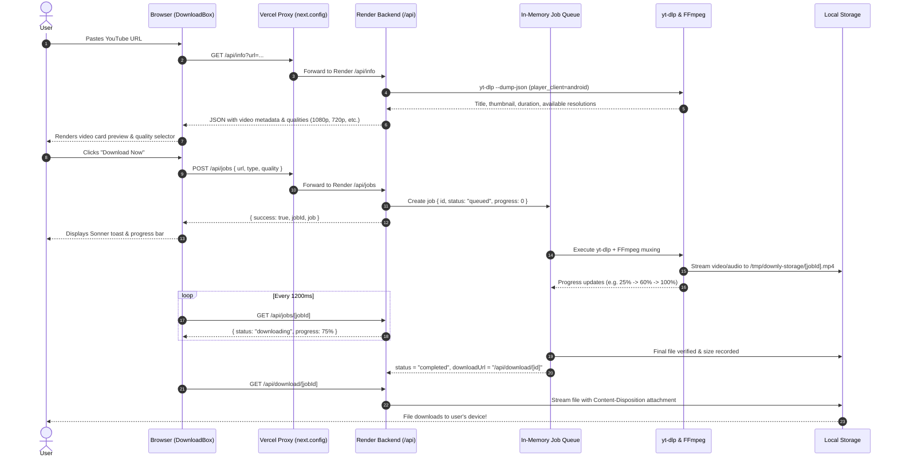

# Downly — Complete Technical Architecture & Project Flow Guide

> **Project Name**: Downly  
> **Tech Stack**: Next.js 16 (Turbopack, App Router), TypeScript, Tailwind CSS, Node.js 22, Deno, yt-dlp, FFmpeg, Docker  
> **Live Frontend (Vercel)**: [https://downly.apearix.com](https://downly.apearix.com)  
> **Live Backend (Render)**: [https://downly-backend-cek2.onrender.com](https://downly-backend-cek2.onrender.com)

---

## 1. Project Overview & Core Philosophy

**Downly** is a high-speed, modern, and ad-free universal media downloader designed to convert and download media (video & audio) from YouTube and other video platforms. 

### Core Challenges Downly Solves:
1. **No Ads / Zero Popups**: Unlike conventional downloaders filled with popunder redirects, malware, and spammy ads, Downly offers a clean, dark-neon luxury UI (`#74da03` neon lime + `#0B0F0D` brand black).
2. **Datacenter Bot Detection Bypass**: Major platforms (like YouTube) block cloud server IPs (AWS, Render, DigitalOcean, Vercel) with `HTTP 403 Forbidden / "Sign in to confirm you're not a bot"`. Downly employs specialized `player_client=android` extraction and Deno-based JS challenge solving to bypass these blocks without mandatory user login.
3. **Hybrid Architecture (Vercel + Render)**: Vercel serverless functions do not bundle `python3` or `ffmpeg` and enforce strict 10s–60s execution limits. Downly separates the lightweight React frontend (hosted on Vercel) from the heavy media extraction container (hosted on Render Docker).

---

## 2. System Architecture & Dual-Deployment Model

```
                    ┌─────────────────────────────────────────┐
                    │               User Browser              │
                    │         (downly.apearix.com)            │
                    └────────────────────┬────────────────────┘
                                         │
                        ┌────────────────┴────────────────┐
                        ▼                                 ▼
             [Static UI / Pages]                [API Calls (/api/*)]
                        │                                 │
                        ▼                                 ▼
           ┌────────────────────────┐         ┌────────────────────────┐
           │   Vercel Edge/Server   │         │     Vercel Rewrites    │
           │     (Next.js App)      │         │    (next.config.ts)    │
           └────────────────────────┘         └───────────┬────────────┘
                                                          │ Proxy to Render
                                                          ▼
                                              ┌────────────────────────┐
                                              │  Render Cloud Service  │
                                              │    (Docker Container)  │
                                              │   Node 22 + Python 3   │
                                              │   FFmpeg + Deno + yt-dlp
                                              └───────────┬────────────┘
                                                          │
                                     ┌────────────────────┴────────────────────┐
                                     ▼                                         ▼
                         ┌───────────────────────┐                 ┌───────────────────────┐
                         │   In-Memory Job Queue │                 │ Local Temp Storage    │
                         │   (queue.ts / worker) │                 │ (/tmp/downly-storage) │
                         └───────────────────────┘                 └───────────────────────┘
```

### Why Dual Deployment?
| Feature / Requirement | Vercel (Frontend) | Render Docker (Backend) |
| :--- | :--- | :--- |
| **Hosting Role** | Fast CDN, static pages, SEO, client UI | Heavy background worker & media processing |
| **Binary Support** | ❌ No native FFmpeg or Python | ✅ Preinstalled Node 22, Python 3, FFmpeg, Deno, yt-dlp |
| **Execution Time** | ⚠️ 10–60s maximum timeout | ✅ Long-running worker processes (5+ minutes for 4K video) |
| **Disk Storage** | ⚠️ Ephemeral / read-only / restricted `/tmp` | ✅ High-speed local disk storage (`/tmp/downly-storage`) |

---

## 3. End-to-End Request & Data Flow (Step-by-Step)

The typical lifecycle of a download request proceeds through 6 distinct stages:



---

## 4. Key Components & File Breakdown

### 4.1 Frontend Components (`src/components/`)
- **`DownloadBox.tsx` (`src/components/home/DownloadBox.tsx`)**:
  - Main user interface component.
  - Controls URL input, platform detection (YouTube, Instagram, etc.), format toggles (MP4 Video / MP3 Audio), quality selector (1080p, 720p, 480p, 360p).
  - Triggers debounced inspection via `/api/info`.
  - Submits download jobs and manages real-time status polling (every 1.2s).
  - Fires **Sonner toast notifications** for paste, started, completed, and error events.
  - Automatically clicks and saves the media file upon job completion, while also providing a manual fallback button.
- **`sonner.tsx` (`src/components/ui/sonner.tsx`)**:
  - Downly custom toast notification engine using `framer-motion` and `lucide-react`.
  - Positioned at `top-right`.
  - Styled with Downly brand colors (`#74da03` neon green accent, `#0B0F0D` brand dark glassmorphism card, rounded borders).

### 4.2 Configuration & Helpers (`src/lib/`)
- **`api.ts` (`src/lib/config/api.ts`)**:
  - `getApiBaseUrl()`: Automatically determines whether to use the local server (`http://localhost:3000`), the direct Render backend (`https://downly-backend-cek2.onrender.com`), or relative rewrites (`""`).
- **`cors.ts` (`src/lib/api/cors.ts`)**:
  - Provides preflight `OPTIONS` handler and uniform `Access-Control-Allow-Origin: *` headers, ensuring smooth cross-origin requests between Vercel and Render.
- **`youtube.ts` (`src/lib/helpers/youtube.ts`)**:
  - Core wrapper around `yt-dlp`.
  - `getYouTubeInfo(url)`: Fetches video titles, durations, thumbnails, and parses valid audio/video format heights.
  - `downloadYouTubeVideo(job, ...)`: Downloads video streams and muxes audio via FFmpeg.
  - `downloadYouTubeAudio(job, ...)`: Extracts best audio stream and transcodes to 320kbps MP3.
- **`queue.ts` (`src/lib/jobs/queue.ts`)**:
  - In-memory asynchronous FIFO job queue with concurrency control (`JOB_CONCURRENCY = 2`).
  - Emits real-time progress callbacks (`onProgress`) which update the job state queried by the client.
- **`storage.ts` (`src/lib/storage/index.ts`)**:
  - Local disk storage manager for media files.
  - Manages file paths in `/tmp/downly-storage/`.
  - Enforces automatic TTL cleanup (default 30 minutes) to prevent server disk overflow.

### 4.3 API Endpoints (`src/app/api/`)
1. **`GET /api/info` (`src/app/api/info/route.ts`)**:
   - Query: `?url=<youtube-url>`
   - Inspects video metadata and returns available resolution choices (`1080p`, `720p`, `480p`, `360p`).
2. **`POST /api/jobs` (`src/app/api/jobs/route.ts`)**:
   - Body: `{ url: string, type: "video" | "audio", quality: string }`
   - Validates input, checks rate limits, registers the job in the queue, and returns the unique `jobId`.
3. **`GET /api/jobs/[id]` (`src/app/api/jobs/[id]/route.ts`)**:
   - Returns current job status (`queued` | `analyzing` | `downloading` | `processing` | `completed` | `failed`), progress percentage (0–100), and download URL.
4. **`DELETE /api/jobs/[id]` (`src/app/api/jobs/[id]/route.ts`)**:
   - Cancels a running job and cleans up any partially downloaded temporary files.
5. **`GET /api/download/[id]` (`src/app/api/download/[id]/route.ts`)**:
   - Streams the finalized MP4 or MP3 file directly to the client browser.
   - Sets headers:
     - `Content-Type: video/mp4` or `audio/mpeg`
     - `Content-Disposition: attachment; filename="..."`
     - `Content-Length: <filesize>`

---

## 5. Critical Technical Solutions & Bot Mitigations

### 5.1 Bypassing YouTube "Sign in to confirm you're not a bot"
When hosted on cloud providers (Render, AWS, DigitalOcean), YouTube blocks standard Web player clients (`web` or `web_creator`) with HTTP 403. 

**Solution implemented in `youtube.ts` & `queue.ts`**:
```typescript
extractorArgs: "youtube:player_client=android",
```
The Android client API does not enforce aggressive IP-range blocking or bot-check challenges that the web client triggers on datacenter IPs.

### 5.2 JavaScript Challenge Solving via Deno
YouTube requires JavaScript challenge solving for deciphering video streaming signatures. Traditional Node runtime arguments often fail or cause warnings.

**Solution implemented in Dockerfile & yt-dlp invocation**:
1. **Dockerfile**: Installs official Deno binary:
   ```dockerfile
   RUN curl -fsSL https://github.com/denoland/deno/releases/latest/download/deno-x86_64-unknown-linux-gnu.zip -o /tmp/deno.zip \
       && unzip /tmp/deno.zip -d /usr/local/bin && chmod +x /usr/local/bin/deno
   ```
2. **Code**: Passes `jsRuntimes: "deno"` directly to `yt-dlp`, enabling instant signature evaluation (`[jsc:deno] Solving JS challenges using deno`).

### 5.3 Fallback Cookies Support
If YouTube ever flags a specific video as age-restricted or private, Downly supports cookies via environment variables:
- Variable: `YOUTUBE_COOKIES` (Netscape format string in `.env`)
- Or physical file: `cookies.txt` in the server root.

---

## 6. Environment Variables Reference

| Variable | Description | Default / Example |
| :--- | :--- | :--- |
| `NEXT_PUBLIC_SITE_URL` | Public URL of the frontend | `https://downly.apearix.com` |
| `NEXT_PUBLIC_API_URL` | Direct backend URL for client requests | `https://downly-backend-cek2.onrender.com` |
| `STORAGE_DIR` | Temp directory for saving media files | `/tmp/downly-storage` |
| `STORAGE_TTL_SECONDS`| Time before downloaded media is auto-deleted | `1800` (30 minutes) |
| `MAX_FILE_SIZE_MB` | Maximum allowed video file size | `500` |
| `RATE_LIMIT_MAX_REQUESTS` | Maximum requests per IP per minute | `120` |
| `YOUTUBE_COOKIES` | Optional Netscape cookies content | `""` |

---

## 7. Local Development & Testing Guide

### Running Locally (Without Docker)
1. Ensure `ffmpeg` and `yt-dlp` are installed on your machine.
2. Clone repository & install dependencies:
   ```bash
   npm install
   ```
3. Copy environment file:
   ```bash
   cp .env.example .env.local
   ```
4. Start Next.js development server:
   ```bash
   npm run dev
   ```
5. Open `http://localhost:3000`.

### Building for Production
```bash
npm run build
npm start
```

---

## 8. Deployment Summary

1. **Frontend (Vercel)**:
   - Connect GitHub repository to Vercel.
   - Set environment variable `NEXT_PUBLIC_API_URL=https://downly-backend-cek2.onrender.com`.
   - Vercel automatically deploys every commit to `main`.
2. **Backend (Render)**:
   - Create a Web Service connected to the GitHub repository.
   - Select **Docker** environment.
   - Set environment variables (`STORAGE_DIR=/tmp/downly-storage`, `NODE_ENV=production`).
   - Render builds the `Dockerfile` with Python 3, FFmpeg, Deno, and yt-dlp.
